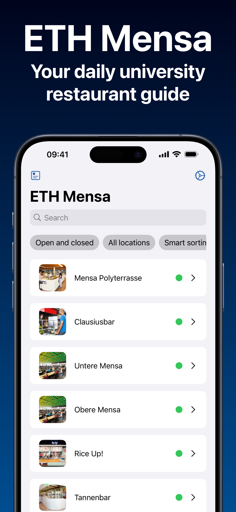
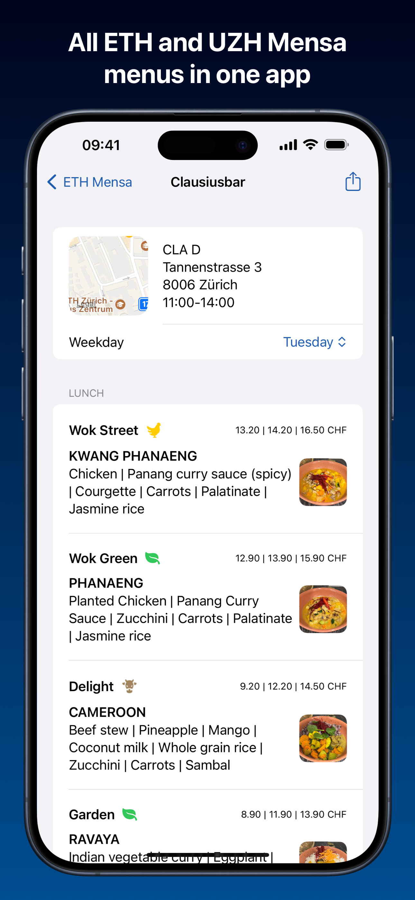
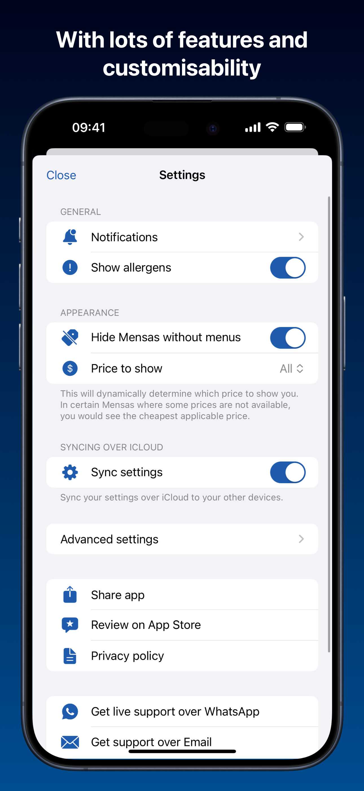

# ETH Mensa (iOS, iPadOS, macOS, watchOS, visionOS)
<br />
<p align="center">
  
</p>
<br />
<p align="center">
  <b>This is the repository for the student-maintained ETH Mensa App for Apple Platforms. If you are looking to install the app, please visit the App Store:</b>
</p>
<p align="center">
  <a href="https://apps.apple.com/app/id1613899399"> </a>
</p>
<br />
<br />
<p align="center">
  
  
  
</p>

## Features
- Browse menus of ETH Zürich and UZH Mensas
- See dishes with image and allergen information
- Intelligent sorting and filter by campus and status
- Check opening times/address of each Mensa
- Get smart and customizable notifications
- Sharing options (App Clip/Shared With You)
- Customize the app to your needs and sync over iCloud
- Apple Watch and Apple Vision Pro app

## Analytics and Privacy
The app does not contain any tracking or analytics whatsoever. Any request to add them will be denied.

## Documentation
You can find a full documentation on the following website:
[ethmensa.ch/documentation](https://ethmensa.ch/documentation/)

Otherwise, the most actual code documentation can be built in Xcode using DocC.

## Requirements
- iOS and iPadOS 16.0+, watchOS 10.0+, macOS 12.0+, visionOS 1.0+
- Mac with Xcode 16.0+
- [SwiftLint](https://github.com/realm/SwiftLint) which can easily be installed using Homebrew: ```brew install swiftlint```

## Installation
1. Clone the repo: ```git clone https://github.com/alexandrereol/ethmensa.git```
2. Change the bundle identifier/team identifier/development team in the project settings
3. Run the app on your device

## Contribute
If you would like to contribute to the codebase, please fork the repository and submit a pull request.

If you are from another school/university and would like to fork this project, feel free to do so while respecting the license. Let us know if you need help setting up the app for your university.

## Maintainer(s)
Alexandre Reol – [@ReolAlexandre](https://x.com/ReolAlexandre) on X/Twitter

## License
Distributed under the *GNU General Public License (GPLv3)* license. See ``LICENSE`` for more information.
